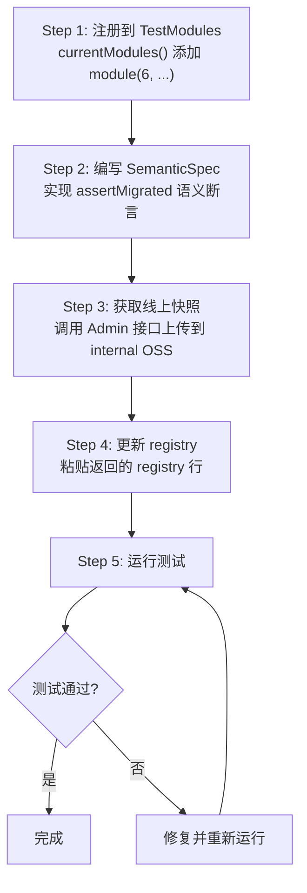
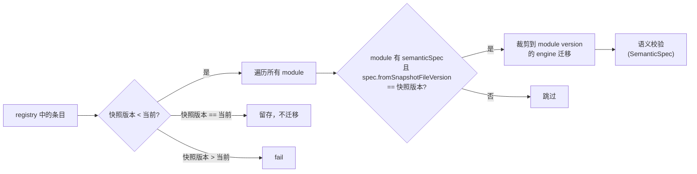

# StateStore 迁移集成测试框架 -- 开发者手册

## 目录

- [1. 简介](#1-简介)
- [2. 新增版本 Step-by-Step 操作指南](#2-新增版本-step-by-step-操作指南)
- [3. 线上 JSON 回归测试](#3-线上-json-回归测试)
- [4. 最佳实践和注意事项](#4-最佳实践和注意事项)
- [5. 常见问题（FAQ）](#5-常见问题faq)
- [附录：核心组件 API 参考](#附录核心组件-api-参考)

---

## 1. 简介

本手册指导开发者在**新增 StateStore 版本**后，如何编写迁移集成测试。

**前置条件**：已完成生产代码的 `XxxStateVersionDefinition`（`@Component`），包含 `version()`、`descriptors()`、`migrate()` 的实现。

**核心机制**：

- 测试框架通过 `StateStoreConfiguration.buildCatalog()` 和 `buildMigrations()` 从 `StateStoreVersionDefinition` 列表构建 TypeRegistryCatalog 和迁移链，**不依赖 Spring Context**
- `StateStoreMigrationTestModules.currentModules()` 是测试框架的**单一版本清单入口**，新增版本只需在此补一条 module 记录
- 框架从远程 URL 加载线上导出的 Snapshot + InRoomClass，走完整恢复路径，按 module version 裁剪 engine 做迁移验证

**验证路径**：

| 验证项 | 说明 |
|--------|------|
| **SemanticSpec 配置强制检查** | 有 definition 的 module，如果存在更旧版本的快照，必须配 semanticSpec |
| **线上 JSON 迁移 + 语义校验** | 从远程 URL 加载真实快照，按 module version 裁剪 engine 迁移，通过 `ResourceSnapshotSemanticSpec` 做字段级断言 |

---

## 2. 新增版本 Step-by-Step 操作指南

以新增 **v6** 版本为例。

### 操作流程图



---

### Step 1: 注册到 TestModules

在 `StateStoreMigrationTestModules.currentModules()` 中添加新的 module：

```java
public static StateStoreMigrationTestModules currentModules() {
    return of(List.of(
            module(1, null, null),
            module(2, new ModuleStateVersionDefinition(), null),
            module(3, new PptStateVersionDefinition(), null),
            module(4, new AgentStateVersionDefinition(),
                    new AgentStateSnapshotSemanticSpec()),
            module(5, new TeachingToolStateVersionDefinition(),
                    new TeachingToolResourceSnapshotSemanticSpec()),
            // 新增
            module(6, new XxxStateVersionDefinition(),
                    new XxxResourceSnapshotSemanticSpec())
    ));
}
```

每个 `module(version, definition, semanticSpec)` 声明版本号、生产 Definition 和线上 JSON 语义校验 Spec。构造时会 fail-fast 校验版本号连续性和匹配性。

> **注**：如果暂时没有线上快照可以先传 `null`，但框架的 `moduleWithDefinitionMustHaveSemanticSpecWhenOlderSnapshotExists` 会在存在旧版本快照时强制要求配 semanticSpec。

---

### Step 2: 编写 ResourceSnapshotSemanticSpec

新建 `XxxResourceSnapshotSemanticSpec.java`，放在 `integration/` 目录下：

```java
public class XxxResourceSnapshotSemanticSpec implements ResourceSnapshotSemanticSpec {

    @Override
    public int fromSnapshotFileVersion() {
        return 5;  // 回测 v5 版本的线上快照
    }

    @Override
    public void assertMigrated(StateStore previousStore,
                                ClassRoomSnapshot classRoomSnapshot,
                                StateStore migratedStore) {
        BranchedStateStore prevBranch = previousStore.beginBranch("check-previous");
        BranchedStateStore migratedBranch = migratedStore.beginBranch("check-migrated");
        try {
            // 1. 已有字段：迁移前后值应保持不变（copyFrom 自动复制）
            assertEquals(
                    prevBranch.getValue(SomeDescriptors.FIELD_A).orElseThrow(),
                    migratedBranch.getValue(SomeDescriptors.FIELD_A).orElseThrow());

            // 2. 新增字段：验证 migrate() 从旧数据回填的值
            // assertEquals(expectedValue, migratedBranch.getValue(XxxDescriptors.NEW_FIELD).orElseThrow());

            // 3. 新增字段无 migrate()，应为空
            // assertTrue(migratedBranch.getValue(XxxDescriptors.OPTIONAL_FIELD).isEmpty());

        } finally {
            prevBranch.abort();
            migratedBranch.abort();
        }
    }
}
```

**三个参数的用途**：

| 参数 | 说明 | 典型用法 |
|------|------|----------|
| `previousStore` | 迁移前的 StateStore（源版本 TypeRegistry 恢复） | 读旧字段值，与迁移后对比 |
| `classRoomSnapshot` | 原始 ClassRoomSnapshot（含 moduleState、sectionState 等旧字段） | 验证从旧字段回填到 StateStore 的逻辑 |
| `migratedStore` | 迁移后的 StateStore（目标版本 TypeRegistry 恢复） | 断言最终值 |

**SemanticSpec 挂接位置**：挂在**引入变更的 module** 上，`fromSnapshotFileVersion()` 返回的是要回测的旧快照版本。框架会自动匹配：只有当快照版本 == `fromSnapshotFileVersion()` 时才执行该 spec。

**按 module version 裁剪验证**：框架会按该 spec 所属 module 的 version 裁剪 definitions，构建只到该版本的 catalog + engine，使 `migrateToCurrent()` 的目标版本恰好是 spec 所属的 module version，而非全局最新版本。

---

### Step 3: 获取线上快照并上传到 Internal OSS

**3a. 从线上日志获取 filePath**

搜索日志关键词 `upload snapshot success`：

```
upload snapshot success, roomId=14801, version=5, size=247079, costMs=148,
  filePath=horizon-private/horizon-classroom/classroom-snapshot/14801_5_1772684679944.json
```

**3b. 调用 Admin 接口**

浏览器直接访问：

```
https://aitutor.zhenguanyu.com/aitutor-classroom-admin/api/dev-tools/snapshots/upload-to-internal-oss?filePath=horizon-private/horizon-classroom/classroom-snapshot/14801_5_1772684679944.json
```

接口会自动：
1. 从线上 private OSS 下载 Snapshot JSON
2. 从 AliOSS 下载对应 roomId 的 InRoomClass JSON
3. 将两个文件上传到 internal OSS 的 `statestore-snapshot/v{version}_production_{date}/` 目录
4. 返回内网可直接下载的 OSS URL

**返回示例**：

```json
{
    "name": "v5_production_20260317",
    "snapshotJsonUrl": "https://yfd-horizon-test.oss-cn-beijing-internal.aliyuncs.com/private-data/statestore-snapshot/v5_production_20260317/classroom_snapshot.json",
    "inRoomClassJsonUrl": "https://yfd-horizon-test.oss-cn-beijing-internal.aliyuncs.com/private-data/statestore-snapshot/v5_production_20260317/in_room_class.json",
    "registry": "v5_production_20260317 https://yfd-horizon-test.oss-cn-beijing-internal.aliyuncs.com/private-data/statestore-snapshot/v5_production_20260317/classroom_snapshot.json https://yfd-horizon-test.oss-cn-beijing-internal.aliyuncs.com/private-data/statestore-snapshot/v5_production_20260317/in_room_class.json"
}
```

---

### Step 4: 更新 registry

将返回的 `registry` 字段值追加到 `src/test/resources/statestore-snapshot/registry` 文件：

```
# 线上 Snapshot 资源列表
v3_production_20260317 https://yfd-horizon-test.oss-cn-beijing-internal.aliyuncs.com/private-data/statestore-snapshot/v3_production_20260317/classroom_snapshot.json https://yfd-horizon-test.oss-cn-beijing-internal.aliyuncs.com/private-data/statestore-snapshot/v3_production_20260317/in_room_class.json
v5_production_20260317 https://yfd-horizon-test.oss-cn-beijing-internal.aliyuncs.com/private-data/statestore-snapshot/v5_production_20260317/classroom_snapshot.json https://yfd-horizon-test.oss-cn-beijing-internal.aliyuncs.com/private-data/statestore-snapshot/v5_production_20260317/in_room_class.json
```

---

### Step 5: 运行测试

运行 `StateStoreMigrationIntegrationTest`，框架会**自动生成**以下测试：

| 测试方法 | 说明 |
|----------|------|
| `moduleWithDefinitionMustHaveSemanticSpecWhenOlderSnapshotExists` | 强制检查有 definition 的 module 是否配了 semanticSpec |
| `testResourceSnapshotMigrations` | 枚举 registry 中所有条目，按 module version 裁剪 engine 迁移 + 语义校验 |

---

## 3. 线上 JSON 回归测试

### 3.1 文件存放与管理

```
src/test/resources/statestore-snapshot/
└── registry    # 每行三列（空格分隔）：name snapshotJsonUrl inRoomClassJsonUrl
```

**registry 文件格式**：
- 每行三列，空格分隔：`name snapshotJsonUrl inRoomClassJsonUrl`
- 空行和 `#` 开头的注释行会被忽略
- name 命名约定：`v{version}_production_{date}`
- URL 指向 internal OSS 的内网直链（`oss-cn-beijing-internal.aliyuncs.com`）

### 3.2 获取线上 JSON

通过 Admin 模块的 `SnapshotDevToolController` 接口一键完成（详见 Step 3）。

接口自动完成以下操作：
1. 从 filePath 解析 roomId
2. 下载线上 Snapshot JSON
3. 下载对应 roomId 的 InRoomClass JSON
4. 上传到 internal OSS
5. 返回 registry 格式的结果

### 3.3 测试执行逻辑

`testResourceSnapshotMigrations()` 自动读取 registry 中的所有条目并生成测试用例：



---

## 4. 最佳实践和注意事项

### 4.1 SemanticSpec 编写原则

SemanticSpec 的职责是验证**该 module 引入的迁移逻辑**是否正确，典型断言模式：

```java
// 1. 已有字段不变：比较 previousStore 和 migratedStore 的同名字段
assertEquals(prevBranch.getValue(FIELD).orElseThrow(),
             migratedBranch.getValue(FIELD).orElseThrow());

// 2. 从 classRoomSnapshot 旧字段迁移：比较旧字段和迁移后的 StateStore 值
assertEquals(classRoomSnapshot.getLegacyField(),
             migratedBranch.getValue(NEW_FIELD).orElseThrow());

// 3. 新增字段无 migrate()：应为空
assertTrue(migratedBranch.getValue(OPTIONAL_FIELD).isEmpty());
```

### 4.2 SemanticSpec 挂接位置

`ResourceSnapshotSemanticSpec` 挂在**引入变更的 module** 上（不是源版本），因为 spec 验证的是该 module 引入的迁移逻辑。

```java
// AgentStateSnapshotSemanticSpec 挂在 v4（引入 AgentState 的 module）
// fromSnapshotFileVersion() 返回 3（回测 v3 快照）
module(4, new AgentStateVersionDefinition(),
        new AgentStateSnapshotSemanticSpec()),
```

### 4.3 按 module version 裁剪验证

框架不会用全量 engine 迁移到最新版本，而是按 spec 所属 module 的 version 裁剪：
- `definitionsUpTo(moduleVersion)` 只取到该版本的 definitions
- 构建局部的 catalog + engine
- `migrateToCurrent()` 的目标版本恰好是 module version

这确保每个 SemanticSpec 只验证自己负责的迁移逻辑，不受后续版本的影响。

### 4.4 copyFrom 机制

MigrationEngine 在执行 `migrate()` 前，会自动 `copyFrom` 复制源版本与目标版本**同名同类型**的 Descriptor 数据。`migrate()` **只需处理**：

- **新增字段**：设置默认值或从旧数据回填
- **删除字段**：无需操作
- **字段类型变更**：手动读取旧值、转换、写入新 Descriptor

### 4.5 完整恢复路径

测试工具通过 `ClassRoomSnapshotSerializable.fromSerializable(inRoomClass)` 走与线上相同的完整恢复路径，确保测试数据的真实性。这要求 registry 中同时注册 Snapshot 和 InRoomClass 两个 URL。

---

## 5. 常见问题（FAQ）

### Q1: 运行测试时报 MainThreadChecker 异常

**现象**：`IllegalStateException: Must be called from main thread`

**解决**：确保 `@BeforeEach` 中设置了 `MainThreadChecker.setMainThread(true)`。集成测试已包含此设置。

### Q2: 远程 URL 下载失败

**现象**：`java.net.ConnectException` 或下载超时

**原因**：registry 中的 URL 是 internal OSS 内网地址（`oss-cn-beijing-internal.aliyuncs.com`），只能在阿里云内网环境访问。

**解决**：确保测试在内网环境执行（CI 机器或通过 VPN 连接内网）。

### Q3: Admin 接口返回 InRoomClass not found

**现象**：`upload-to-internal-oss` 返回 404

**原因**：该 roomId 对应的 InRoomClass 在 AliOSS 上不存在或已过期。

**解决**：选择仍在线上可用的 roomId 重新导出。建议在版本发布后及时导出快照。

### Q4: moduleWithDefinitionMustHaveSemanticSpecWhenOlderSnapshotExists 测试失败

**现象**：测试提示某个 module 必须配置 semanticSpec

**原因**：该 module 有 definition（引入了迁移变更），且 registry 中存在版本 < module version 的快照文件，但未配置 semanticSpec。

**解决**：为该 module 编写 `ResourceSnapshotSemanticSpec` 并注册到 `currentModules()`。

### Q5: 新增版本后需要修改哪些文件？

| 文件 | 必须 | 说明 |
|------|------|------|
| `XxxStateVersionDefinition.java` | 是 | 生产代码，`@Component` |
| `XxxResourceSnapshotSemanticSpec.java` | 是* | 线上 JSON 语义校验（存在旧版本快照时强制） |
| `StateStoreMigrationTestModules.currentModules()` | 是 | 注册新 module |
| `statestore-snapshot/registry` | 推荐 | 注册线上 JSON 远程 URL |
| `StateStoreConfiguration.java` | **不需要** | 框架自动扫描 |
| `StateStoreMigrationIntegrationTest.java` | **不需要** | 从 TestModules 自动导出 |

> *如果 registry 中存在旧版本快照，semanticSpec 就是必须的。

### Q6: semanticSpec 传 null 可以吗？

可以，但仅限于以下场景：
- 该 module 没有 definition（如 v1）
- registry 中不存在版本 < module version 的快照文件

否则 `moduleWithDefinitionMustHaveSemanticSpecWhenOlderSnapshotExists` 会强制报错。

---

## 附录：核心组件 API 参考

### A.1 ResourceSnapshotSemanticSpec（语义校验扩展点）

**文件路径**：`aitutor-classroom-java/src/test/java/.../store/migration/integration/ResourceSnapshotSemanticSpec.java`

| 方法 | 签名 | 说明 |
|------|------|------|
| `fromSnapshotFileVersion()` | `int fromSnapshotFileVersion()` | 该 Spec 要回测的线上快照版本 |
| `assertMigrated()` | `void assertMigrated(StateStore previousStore, ClassRoomSnapshot classRoomSnapshot, StateStore migratedStore)` | 对迁移结果做语义断言 |

### A.2 StateStoreMigrationTestModules（测试版本清单）

**文件路径**：`aitutor-classroom-java/src/test/java/.../store/migration/integration/StateStoreMigrationTestModules.java`

| 方法 | 说明 |
|------|------|
| `currentModules()` | 唯一的版本维护入口 |
| `module(version, definition, semanticSpec)` | 声明一个版本的 module（3 参数） |
| `modules()` | 导出所有 Module 列表 |
| `definitions()` | 导出所有非 null 的 StateStoreVersionDefinition |
| `definitionsUpTo(maxVersion)` | 导出 version <= maxVersion 的所有非 null definitions |

**Module record**：

| 字段 | 类型 | 说明 |
|------|------|------|
| `version` | int | 版本号 |
| `definition` | StateStoreVersionDefinition | 生产代码 Definition，v1 为 null |
| `semanticSpec` | ResourceSnapshotSemanticSpec | 语义校验 Spec，可为 null |

### A.3 StateStoreSnapshotTestUtils（测试工具类）

**文件路径**：`aitutor-classroom-java/src/test/java/.../store/migration/integration/StateStoreSnapshotTestUtils.java`

| 方法 | 说明 |
|------|------|
| `loadSnapshot(entry)` | 从远程 URL 加载 ClassRoomSnapshot JSON，提取 StateStoreSnapshot |
| `loadClassRoomSnapshot(entry)` | 从远程 URL 下载 Snapshot + InRoomClass，走完整恢复路径 |
| `listSnapshotEntries()` | 读取 registry 文件，解析为 SnapshotEntry 列表 |
| `restoreSnapshot(snapshot, registry)` | 恢复 StateStoreSnapshot 到 InMemoryStateStore |

**SnapshotEntry record**：

| 字段 | 类型 | 说明 |
|------|------|------|
| `name` | String | 如 `v5_production_20260316`，标识版本和日期 |
| `snapshotJsonUrl` | String | ClassRoomSnapshot JSON 的 OSS 内网 URL |
| `inRoomClassJsonUrl` | String | InRoomClass JSON 的 OSS 内网 URL |

### A.4 StateStoreMigrationIntegrationTest（集成测试）

**文件路径**：`aitutor-classroom-java/src/test/java/.../store/migration/StateStoreMigrationIntegrationTest.java`

| 测试方法 | 类型 | 说明 |
|----------|------|------|
| `moduleWithDefinitionMustHaveSemanticSpecWhenOlderSnapshotExists` | `@Test` | 强制检查 semanticSpec 配置完整性 |
| `testResourceSnapshotMigrations` | `@TestFactory` | 枚举 registry 条目，按 module version 裁剪 engine 做迁移验证 + 语义校验 |

### A.5 SnapshotDevToolController（Admin 开发工具接口）

**文件路径**：`aitutor-classroom-java-admin/src/main/java/.../admin/ctrl/SnapshotDevToolController.java`

| 接口 | 说明 |
|------|------|
| `GET /aitutor-classroom-admin/api/dev-tools/snapshots/upload-to-internal-oss` | 一键下载 Snapshot + InRoomClass，上传到 internal OSS |

| 参数 | 类型 | 必填 | 说明 |
|------|------|------|------|
| `filePath` | String | 是 | Snapshot 的 OSS 文件路径，从线上日志获取 |
| `bucketName` | String | 否 | OSS bucket，默认 private bucket |

| 返回字段 | 说明 |
|----------|------|
| `name` | 目录名，如 `v5_production_20260317` |
| `snapshotJsonUrl` | Snapshot 的 internal OSS 内网 URL |
| `inRoomClassJsonUrl` | InRoomClass 的 internal OSS 内网 URL |
| `registry` | 可直接粘贴到 registry 文件的完整行 |
