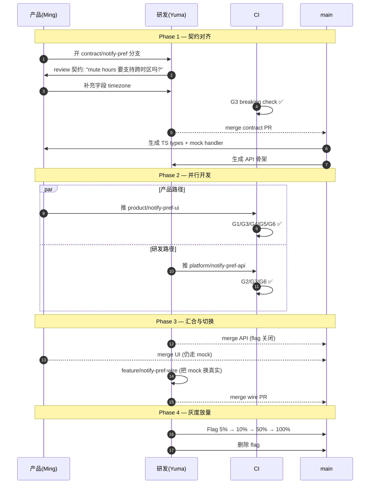

# v3: 协作分支 + CI Gate + 时序图

> **触发问题**: 框架落地需要可执行的机制,怎么用分支策略 + CI 把"谁能动什么"编码到仓库本身?
> **结论信心度**: 中高 — 有具体的 CI 脚本和时序图,但假设了一个致命前提(契约先行)
> **被下一版如何推翻**: 这一版把"契约先行"当成必然步骤,忽视了产品探索期需求本身就在剧烈变化。v4 用"双空间"解开这个死结。

## 协作分支设计

核心思想：**用分支命名 + CODEOWNERS + CI gate 三层配合，把"谁能动什么"编码到仓库本身**，不是靠 review 时的人肉记忆。

### 分支语义

| 分支前缀 | 允许触碰的路径 | 必须 review 方 | 合入方式 |
|---|---|---|---|
| `platform/*` | 全部 | 研发 2 人 | squash |
| `feature/*` | 全部 | 产品 1 + 研发 1 | squash |
| `product/*` | 仅安全区 | 研发 1 | squash |
| `contract/*` | 仅 `contracts/**` | 产品 1 + 研发 1 | merge（保留历史） |
| `hotfix/*` | 全部 | 研发 1 | cherry-pick 回 main |

### CODEOWNERS 示例

```
*                            @team/engineering
/app/ui/**                   @team/product @team/engineering
/app/mocks/**                @team/product
/e2e/**                      @team/product @team/engineering
/stories/**                  @team/product
/contracts/**                @team/product @team/engineering
/app/api/**                  @team/engineering
/db/migrations/**            @team/engineering @team/dba
/infra/**                    @team/sre
/app/core/**                 @team/engineering
```

## 6 道 CI Gate（按成本从低到高）

### Gate 1：路径越权检查（最便宜、最重要）

```yaml
if: startsWith(github.head_ref, 'product/')
run: |
  CHANGED=$(git diff --name-only origin/main...HEAD)
  FORBIDDEN=$(echo "$CHANGED" | grep -E '^(app/api/|db/|infra/|app/core/)')
  if [ -n "$FORBIDDEN" ]; then exit 1; fi
```

**语义**：`product/*` 分支一旦碰了 API、DB、infra、core，CI 直接挂掉。挡住 80% 的越界。

### Gate 2：Schema 漂移检测

产品最容易无意识破坏的就是数据模型。Schema 改动必须配套 migration 文件，且必须在 platform/* 或 feature/* 分支。

### Gate 3：契约一致性（核心！）

```yaml
- name: Types generated from contracts are up-to-date
- name: Mock and real API conform to contract
- name: Breaking change detection
```

契约是产品和研发之间唯一真正的硬边界。

### Gate 4：写入路径保护

扫描产品分支里的写操作（Prisma create/update/delete、SQL INSERT/UPDATE/DELETE、POST 请求）。不 block，只 warn，强制 review 注意。

### Gate 5：Feature Flag 强制

产品直接合入 main 的新路由必须在 flag 保护下。

### Gate 6：质量 & 性能基线

Lint strict / Type check / Bundle size regression / E2E 必须覆盖新页面 / Lighthouse budget。

### Gate 汇总矩阵

| Gate | `platform/*` | `feature/*` | `product/*` | `contract/*` |
|---|:-:|:-:|:-:|:-:|
| G1 路径越权 | — | — | ✅ strict | ✅ only contracts/ |
| G2 Schema drift | ⚠️ 需 DBA | ⚠️ 需 DBA | ❌ block | — |
| G3 契约一致性 | ✅ | ✅ | ✅ | ✅ + breaking detect |
| G4 写入扫描 | info | info | ⚠️ warn | — |
| G5 Feature flag | 可选 | ✅ | ✅ enforce | — |
| G6 质量基线 | ✅ | ✅ | ✅ | ✅ |

## 完整协作时序图

以"给 Schedule 添加 Slack 通知偏好设置"为例：



## 关键节奏点

1. **契约先行** — 任何跨角色工作的第一个 PR 必须是契约 PR
2. **并行不阻塞** — 契约一锁，产品和研发各自分支推进
3. **三个合入点而非一个** — API 上线（flag 关）→ UI 上线（仍 mock）→ wire PR 切换
4. **灰度在研发手上** — 产品定义"对不对"，研发决定"放多快"
5. **E2E 是产品的遗产** — 不是临时验收，是永久回归防线

## 当时的小结

> **协作分支和 CI 的本质不是"限制产品"，而是把产品和研发之间的"信任边界"物化为可执行的规则。**
>
> 一旦 CI 能自动挡住越界写入，研发就敢真正放手让产品独立交付 UI 切片；产品也能安心用 AI 大量产出而不必担心弄坏系统。**机制取代了监督，才有真正意义上的高速协作。**

## 当时未解决的问题（留给 v4，被用户戳破）

**用户的反问**：
> "你的设计里,产品其实承担的是过去纯前端工程师的工作,预期一开始产品的需求就是准确的,但事实上产品在前期可能需要进行多次迭代调整,这个时期很难要求先产出准确的契约。"

这个反问击穿了 v3 的核心假设——**契约先行** 要求需求已经稳定。但产品探索期的需求**本身**就是输出物,契约频繁变更会让 CI 变成负担而非护栏。

v4 的双空间架构就是为了解开这个死结。
