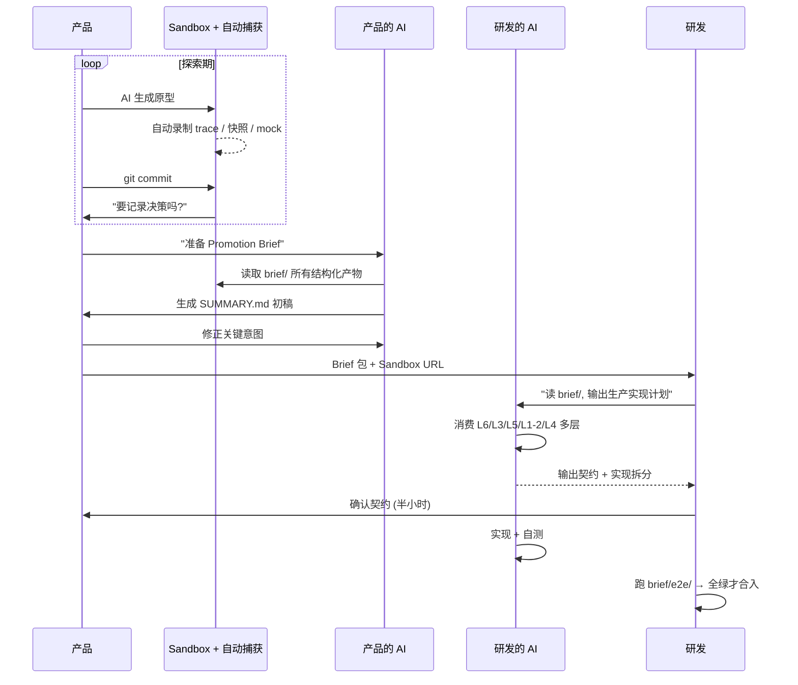

# v5: Promotion Brief 的 L0-L6 结构化

> **触发问题**: 产品产出的 Brief 怎么保证易于 AI 理解? 否则研发侧 AI 还要花大量时间重新对齐
> **结论信心度**: 中 — 结构化思路正确,但假设"自动捕获"能力可能过度乐观
> **在 v6 里的延续**: v6 讨论工具链可行性时,会对这里的自动捕获能力做更诚实的技术评估。

## 问题的重新定位

Brief 不是"文档不够好"的问题，而是**整个协作链路的"信息损耗点"发生了位移**：

- 过去：`PRD（人写给人看）→ 研发理解 → 写代码` 中间损耗在**人解读文档**
- 现在：`Sandbox（AI 生成）→ Promotion Brief → 研发+AI 重新实现` 中间损耗在**AI 重新理解**

**Brief 本身不是给人看的，是给 AI 消费的。** 如果 Brief 仍然是"人类叙事"，那 AI 就要再做一次"叙事→代码"的翻译，等于把探索期的成果丢了一大半。

## 核心转变: 从"产出文档"到"产出可机读包"

Brief 应该是一个**结构化的、多模态的"证据包"**，让下游 AI 能直接消费。

## Brief 的七层结构（AI-Native Format）

### L0：Sandbox 仓库本身（最关键）

**Sandbox 代码不是废弃物，而是 Brief 的主体。** 下游 AI 能直接 clone 和运行 Sandbox，比任何文档描述都强。

配套要求：
- Sandbox 必须能**一键启动**
- 所有 mock 数据写死在仓库里，不依赖外部服务
- README 只写一行："跑 `pnpm dev` 直接看"

### L1：交互行为录制（Interaction Trace）

用 Playwright / Chrome DevTools 录制核心路径的完整 trace：

```
brief/traces/
├── happy-path.json       # Playwright trace
├── happy-path.webm       # 录屏（人类看）
├── edge-case-1.json
└── edge-case-2.json
```

Trace 文件是**完整可回放**的：DOM 快照 + 网络请求 + 用户事件。

### L2：组件树 + 状态快照

Sandbox 运行时的组件树和 state 机器可以 dump 出来：

```json
{
  "route": "/schedule",
  "component_tree": {
    "SchedulePage": {
      "state": { "filter": "all", "sortBy": "created_at" },
      "children": { "ScheduleList": { ... } }
    }
  },
  "data_dependencies": [
    { "endpoint": "/api/schedules", "shape": "Schedule[]" }
  ]
}
```

### L3：数据契约草稿（Type-First）

不是 OpenAPI（太重），而是**带注释的 TypeScript 类型**：

```typescript
/**
 * @stability: explored  // explored | validated | locked
 * @iterations: 5        // 探索期改过几版
 * @confidence: high
 */
export type Schedule = {
  id: string
  title: string
  cron: string

  /**
   * 经过 3 轮用户测试确认需要
   * 取消了 muteHours，因为用户反馈太复杂
   */
  notifyChannel?: 'slack' | 'email' | 'none'
}
```

**语义化的注释是给 AI 读的**——告诉下游 AI"哪些字段是探索过的"vs"哪些是随便写的"。

### L4：决策日志（Decision Log）

```yaml
- id: D-001
  date: 2026-04-15
  question: "通知偏好要不要支持免打扰时段?"
  hypothesis: "用户需要精细控制接收时间"
  test: "v1 原型给 5 个用户试用"
  finding: "只有 1/5 用过, 配置成本 > 收益"
  decision: "砍掉免打扰时段"
  rejected_alternatives:
    - "用预设的 3 个时段模板"
```

**下游 AI 读到这个文件就知道: 哪些设计是"刻意的约束", 不能在 Promotion 时"优化"回去**。

这解决了一个典型翻车场景：研发的 AI 看 Sandbox 觉得"通知偏好太简陋"，顺手"完善"成完整的偏好设置——把产品探索掉的功能又加回来了。

### L5：E2E 测试套件（验收标准）

从 Sandbox 阶段就开始写，作为 Promotion 后的**验收标准**。比文档更硬的对齐方式。

### L6：语义摘要（给 AI 的 TL;DR）

一个专门写给 AI 看的 Markdown，结构高度固定：

```markdown
# Promotion Brief: [Feature Name]

## 核心意图（一句话）
## 已验证的范围
- ✅ ...
## 探索后明确砍掉的（禁止恢复）
- ❌ ... (见 decisions.yaml D-001)
## 未决定，留给研发判断
- ? ...
## 已知边界 case
- ...
## 关键路径的成功标准
见 brief/e2e/*.spec.ts （必须全绿）
```

**格式严格固定**，下游 AI 只需理解一次模板，之后每次 Promotion 按同样结构消费。

## 如何让产品"自然产出"这七层？

让产品手工维护不现实，依赖**工具链自动捕获**：

| 层 | 产出方式 |
|---|---|
| L0 | Sandbox 仓库本身 |
| L1 | Sandbox dev 模式自动注入 recorder |
| L2 | React DevTools 协议 + state middleware |
| L3 | 从 mock types 自动 dump |
| L4 | Commit hook 提示 30 秒记录 |
| L5 | Playwright codegen |
| L6 | 用产品侧的 AI 消费 L0-L5 生成初稿 |

**关键点**: L6 的摘要用"产品侧的 AI"生成, 而不是"研发侧的 AI"。产品用自己的 AI 写摘要比直接把原始材料丢给研发的 AI 好——因为产品知道自己的意图,可以纠正 AI 的误解。

## 修订后的 Promotion 时序



## 信息密度对比

| 格式 | 下游 AI 消费难度 | 信息密度 | 易产出度 |
|---|---|---|---|
| 传统 PRD（Markdown 叙事） | 高（需解读） | 低 | 慢 |
| Figma + 注释 | 高（视觉→代码） | 中 | 中 |
| Sandbox 代码 + 手写 Brief | 中 | 高 | 慢 |
| **L0-L6 结构化 Brief** | **低（直接消费）** | **极高** | **快** |

## 对 AI 友好的三个特性

1. **可执行** — L0 能跑、L5 能验证——AI 不需要"想象"，可以"观察"
2. **结构化** — L2/L3/L4 是机器格式——AI 不需要 NLP 解析
3. **有语义标签** — `@stability: explored`、`rejected_alternatives`——AI 能识别"哪些决定不能推翻"

## 当时的小结

> **AI 时代的 Promotion Brief 不是"写给研发的文档"，而是"写给下游 AI 的结构化上下文包"。**
>
> 产品的探索过程本身就是一系列对 AI 有价值的信号（交互、状态、决策、测试），关键是**在探索时就自动捕获这些信号**，而不是事后靠"写文档"重建。
>
> 更激进的表述：**探索期的 Sandbox 仓库 + 自动捕获的痕迹 = Brief 本身。产品不需要额外"写" Brief，只需要在探索时留下正确的痕迹。**

## 当时未解决的问题（留给 v6，被用户戳破）

**用户的反问**：
> "产品如何进行功能迭代呢? 不可能新开一个 sandbox, 但沿用旧的时间长了, 可能会逐渐腐化, 且与实际的生产代码差异较大, 导致自动产出的 promotion brief 质量很低或者存在较多错误。"

这个反问戳中了 v4-v5 的隐性假设：**每个功能只探索一次**。现实中产品持续迭代，v4 的"长期 Sandbox"会逐渐漂移脱离生产。

v6 的 Ephemeral Sandbox 就是为此而设。
