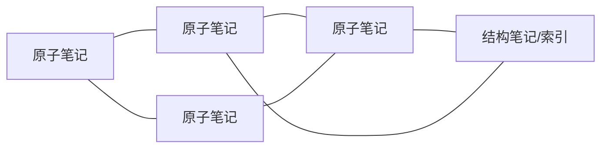
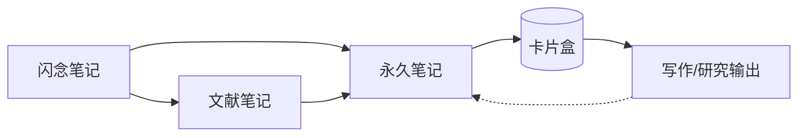

# Zettelkasten（卡片盒笔记法）

> 以原子卡片 + 显式链接构建知识网络的笔记方法，由社会学家 Niklas Luhmann 发明并用其产出 70+ 本书、400+ 篇论文。

## 是什么

Zettelkasten（德语字面义"纸条盒子"）是一种**以原子卡片为单位、以显式链接为骨架**的个人知识管理方法。核心不在"记录"，而在**让想法之间自然发生连接**——卡片盒不是仓库，而是你思考的外部化对话伙伴。

Luhmann 本人用的是实体卡片 + 层级编号（如 `21/3d7a`）。数字时代多数工具（Obsidian、Roam、Logseq 等）用文件名 + 双向链接取代了编号。

### 与普通笔记的区别

普通笔记：按目录/日期组织，重在"保存"，找到后读一遍就结束。
Zettelkasten：按想法组织，重在"连接"，每次添加卡片都要问"这与已有卡片有什么关系？"

## 三个核心原则

### 1. 原子化（Atomicity）

**一张卡片只讲一个概念/一个想法**。不是因为简短好看，而是因为：
- 颗粒太粗，卡片无法被其他语境复用
- 颗粒太细，连接没有意义

判据：如果你想用"这篇卡片讲 X 和 Y"来描述，通常应该拆成两张。

### 2. 唯一标识（Unique ID）

每张卡片有唯一入口。Luhmann 用层级编号使物理卡片能"插入相邻位置"，数字工具里常见方案：
- **时间戳**：`202604291530-zettelkasten.md`（Roam 风格）
- **短句文件名**：`zettelkasten.md`（Obsidian 风格，llm-wiki 采用）
- **UUID**：极少数工具使用，人类不可读

### 3. 显式链接（Linking）

卡片之间通过链接成网，而不是通过目录成树。这是 Zettelkasten 最独特的一点：

网络结构带来的收益：
- **涌现主题**：高度互联的集群自然形成主题
- **抗遗忘**：新卡片强制你回顾相关旧卡片
- **写作友好**：顺着链路走一遍就是一篇文章的骨架

## 三类笔记

Sönke Ahrens 在《How to Take Smart Notes》中把 Zettelkasten 的工作流拆成三类笔记，边界清晰：

| 类型 | 何时产生 | 寿命 | 处理方式 |
|------|---------|------|---------|
| **Fleeting notes（闪念笔记）** | 灵感突现、地铁里、会议中 | 几天 | 当日清空，要么丢弃要么转永久笔记 |
| **Literature notes（文献笔记）** | 阅读某篇文章/书时 | 跟随原资料 | 用**自己的话**重写要点，不抄原文 |
| **Permanent notes（永久笔记）** | 经过思考、融入卡片盒 | 永久 | 原子化 + 加入链接，每张独立成篇 |

### 工作流

关键纪律：**不把原文直接放进卡片盒**。必须经过"用自己的话改写"这一步——这是思考发生的地方，也是区分收藏夹和 Zettelkasten 的分水岭。

## 为什么有效

1. **降低写作门槛**：当你要写一篇 5000 字的文章时，不是从白纸开始，而是已有 20 张相关永久笔记可以串联
2. **对抗 collector's fallacy**：收藏但不消化的资料价值接近零。Zettelkasten 的"必须改写"强制消化
3. **知识的复利**：第 N 张卡片的边际价值随 N 增长（连接机会变多），与线性笔记相反
4. **意外发现**：回顾时常常看到两张久远的卡片意外相关，这是线性笔记几乎不会发生的

## 与 llm-wiki 的关系

llm-wiki（本知识库）本质上是 **Zettelkasten 的 LLM 增强版**：

| Zettelkasten 要素 | llm-wiki 对应 |
|------------------|--------------|
| 原子卡片 | `concepts/*` 概念页（一页一概念） |
| 唯一 ID | 文件名（小写连字符） |
| 显式链接 | `[[wikilink]]` 双向链接 |
| Structure note | `index.md` + `synthesis/*` |
| Literature note | `sources/*` 源摘要页 |
| Permanent note | `concepts/*` + `entities/*` |
| 手工维护连接 | LLM 自动维护交叉引用（[[llm-wiki|LLM Wiki 模式]]） |

差异：Luhmann 花 30 年累积 90000 张卡片。LLM 把"原子化 + 交叉引用 + lint 检查"这些维护负担自动化后，个人用户也可以享受 Zettelkasten 的复利。

## 常见误区

- **追求完美的第一张卡**：Zettelkasten 的价值在网络，不在单卡质量。先写下，之后重构。
- **只收集不链接**：没有链接的卡片等于没有卡片。每新增一张必须找 1–3 张相关卡链接过去。
- **把目录当作骨架**：目录是物理存储，不是思想结构。思想结构应由链接承担。
- **分类太早**：不要一开始就规划完整的 taxonomy。让主题从集群中涌现。

## 项目实践

### 2026-04-aitutor-arch
- `projects/2026-04-aitutor-arch/deliverables/voice-pipeline.md` — 在整理 AI 家教语音链路 deliverable 时，主动学习 Zettelkasten 方法以改进个人知识沉淀流程
- 背景：需要判断是否把 deliverable 中可复用的架构思路拆细成 wiki 概念页，Zettelkasten 的"原子化 + 链接"原则给了直接指导

## 相关概念

- [[llm-wiki|LLM Wiki]] — Zettelkasten 的 LLM 增强版，本知识库采用的模式
- [[rag|RAG]] — 另一种 LLM 知识处理模式，与"编译型"的 llm-wiki/Zettelkasten 对比
