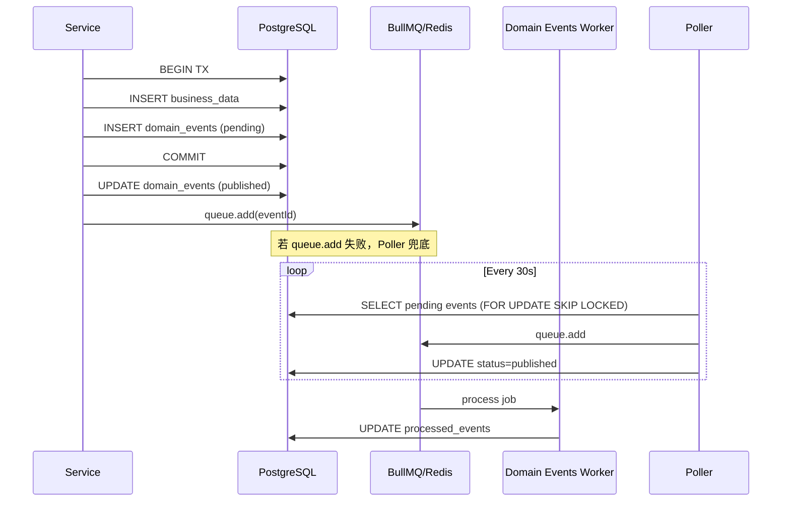

# 消息队列（Message Queue）

> 消息队列是一种异步通信机制，生产者将任务/消息写入队列，消费者（Worker）按自己的节奏取出并处理，实现系统解耦与削峰填谷。

## 是什么

消息队列将"发出请求"和"处理请求"两件事在时间和进程上分离。生产者只管把任务丢进队列，消费者负责在合适的时机取出、执行。两者可以是同一进程，也可以跨进程、跨服务器。

```
生产者           队列（Redis）        消费者（Worker）
  │                  │                     │
  │── add(job) ──►   │                     │
  │                  │── job ─────────────►│
  │                  │                     │── process()
  │                  │◄── ack ─────────────│
```

### 核心概念（BullMQ 术语）

| 术语 | 含义 |
|------|------|
| **Queue** | 队列实例，负责添加 job（生产者视角） |
| **Worker** | 消费者实例，监听队列并执行 processor 函数 |
| **Job** | 队列中的工作单元，包含 data + 元数据（attempts、delay 等） |
| **jobId** | Job 的唯一标识，相同 jobId 的 job 不会重复入队（去重） |
| **Repeatable Job** | 按固定频率重复执行的定时 job |

## 为什么重要

在 Web 服务中，以下场景必须引入消息队列：

1. **长耗时任务**（AI 生成论文可能需要几分钟）：HTTP 请求不能等这么久，必须异步。
2. **削峰**：高并发下游服务限速，队列作缓冲。
3. **可靠重试**：网络抖动、下游超时，队列内置重试机制可自动补偿。
4. **解耦**：支付成功后通知多个下游（发积分、发邮件），不需要支付服务直接调用它们。

## BullMQ 基本用法

BullMQ 基于 Redis，是 Node.js 生态中最成熟的队列库。

### 定义队列

```ts
// apps/api/src/infra/queue/index.ts
import { Queue } from 'bullmq'

export const fulltextQueue = new Queue<FulltextJobData>('fulltext-generation', {
  connection: createBullMQConnection(),
  defaultJobOptions: {
    attempts: 3,                        // 最多重试 3 次
    backoff: { type: 'exponential', delay: 5000 }, // 指数退避
  },
})
```

### 添加 Job（生产者）

```ts
await fulltextQueue.add('generate', { taskId, paperId, articleType })
```

加 `jobId` 可实现去重（相同 jobId 不会重复入队）：

```ts
await domainEventsQueue.add('domain-event', { eventId }, { jobId: eventId })
```

### 创建 Worker（消费者）

```ts
// apps/api/src/worker.ts
const worker = new Worker<FulltextJobData>(
  'fulltext-generation',
  async (job) => {
    await runFulltextWorkflow(job.data, step, env)
  },
  { connection: createBullMQConnection(), concurrency: 3 }
)

worker.on('completed', (job) => console.log(`done: ${job.id}`))
worker.on('failed', (job, err) => console.error(`failed: ${job?.id}`, err))
```

### 指数退避（Exponential Backoff）

重试不是立即重试，而是等待越来越长的时间，避免雪崩：

```
第 1 次失败 → 等待 5s → 重试
第 2 次失败 → 等待 25s → 重试
第 3 次失败 → 等待 125s → 放弃（标记 failed）
```

## Outbox Pattern（事务性消息）

### 问题

分布式系统中，"更新数据库"和"发送消息"是两个独立操作，可能出现：
- 数据库更新成功，但消息发送失败 → 消息丢失
- 消息发送成功，但数据库回滚 → 幽灵消息

### 解法：Outbox 表

将消息先写入同一数据库的 Outbox 表（与业务数据在同一事务），再由异步 Poller/发布者把消息投递到真正的消息队列。

```
事务内：                          事务外（best-effort）：
  INSERT business_data              publishEvent(eventId)
  INSERT domain_events              ↓ 失败？Poller 30s 后补偿
  (status='pending')
```



### 关键代码

```ts
// emitter.ts — 事务内只写 Outbox，不做网络调用
export async function emitEvent(tx, input) {
  await tx.insert(domainEvents).values({ ...input, status: 'pending' })
}

// 事务外 best-effort 投递
export async function publishEvent(eventId) {
  try {
    await domainEventsQueue.add('domain-event', { eventId }, { jobId: eventId })
    await db.update(domainEvents).set({ status: 'published' })
  } catch (err) {
    logger.warn('publish_failed', { eventId }) // Poller 会补偿
  }
}
```

## 幂等性（Idempotency）

同一条消息可能因重试被处理多次，消费者必须保证多次处理结果与一次相同。

### 方案 1：jobId 去重（队列层面）

```ts
// 相同 jobId 不会重复入队
queue.add('event', { eventId }, { jobId: eventId })
```

### 方案 2：processed_events 表（业务层面）

```ts
// 处理前查是否已处理过
const [existing] = await db.select().from(processedEvents)
  .where(and(eq(processedEvents.eventId, eventId), eq(processedEvents.handlerName, handlerName)))

if (existing?.result != null) {
  return // 已成功处理，跳过
}

// 首次：INSERT 占位（result=NULL）
await db.insert(processedEvents).values({ eventId, handlerName })

// 执行 handler
await handler(event)

// 成功后写入 result
await db.update(processedEvents).set({ result: { status: 'success' } })
```

### 方案 3：步骤缓存（进程内幂等）

```ts
// worker.ts — createJobStep
export function createJobStep() {
  const cache = new Map<string, unknown>()
  return {
    do: async (name, fn) => {
      if (cache.has(name)) return cache.get(name)   // 命中缓存，跳过
      const result = await fn()
      cache.set(name, result)
      return result
    }
  }
}
```

> 注意：进程内缓存在跨进程重试时失效（进程崩溃重启后缓存丢失）。

## SELECT FOR UPDATE SKIP LOCKED

多个 Poller 实例并发扫描时，需要防止同一事件被多个实例重复处理：

```sql
SELECT id, retry_count
FROM domain_events
WHERE status = 'pending'
  AND created_at < $cutoff
LIMIT 100
FOR UPDATE SKIP LOCKED   -- 跳过已被其他事务锁定的行
```

- `FOR UPDATE`：对查询到的行加排他锁
- `SKIP LOCKED`：遇到已被锁定的行直接跳过，而不是等待

必须在**事务内**执行，否则锁立即释放，`SKIP LOCKED` 形同虚设。

## Repeatable Job（定时任务）

```ts
// 每 30 秒执行一次，固定 jobId 防止多实例重复注册
await pollerQueue.add('poll', {}, {
  repeat: { every: 30 * 1000 },
  jobId: 'domain-events-poller',   // 幂等注册
})
```

## 项目实践

### kaigao

**文件位置：**

- `apps/api/src/infra/queue/index.ts` — 4 个队列定义（fulltext-generation、order-recovery、reduce-generation、domain-events）
- `apps/api/src/worker.ts` — fulltext worker + createJobStep 步骤缓存
- `apps/api/src/shared/event-bus/emitter.ts` — Outbox emitEvent / publishEvent
- `apps/api/src/shared/event-bus/worker.ts` — Domain Events Worker + processed_events 幂等
- `apps/api/src/workers/domain-events-poller.ts` — 补偿 Poller，SELECT FOR UPDATE SKIP LOCKED

**队列清单：**

| 队列名 | 用途 | 重试次数 |
|--------|------|---------|
| `fulltext-generation` | AI 生成论文全文 | 3 次 |
| `order-recovery` | 支付补偿/订单恢复 | 10 次 |
| `reduce-generation` | AI/查重降率任务 | 3 次 |
| `domain-events` | 领域事件（DDD Outbox） | 5 次 |
| `domain-events-poller` | Outbox 补偿扫描（定时） | — |

**设计亮点：**
- Outbox Pattern 保证事件不丢失（先入 DB，再投 Redis）
- `processed_events` 表实现 Handler 粒度幂等
- `SELECT FOR UPDATE SKIP LOCKED` 在 SAE 水平扩缩容时安全并发
- Poller 10 秒延迟 + 5 次上限 + `max_retry_exceeded` 终态

## 相关概念

- [[react-framework]] — 事件驱动在 Agent 场景中的类比
- [[multi-agent]] — 跨 Agent 通信也需要消息传递机制
