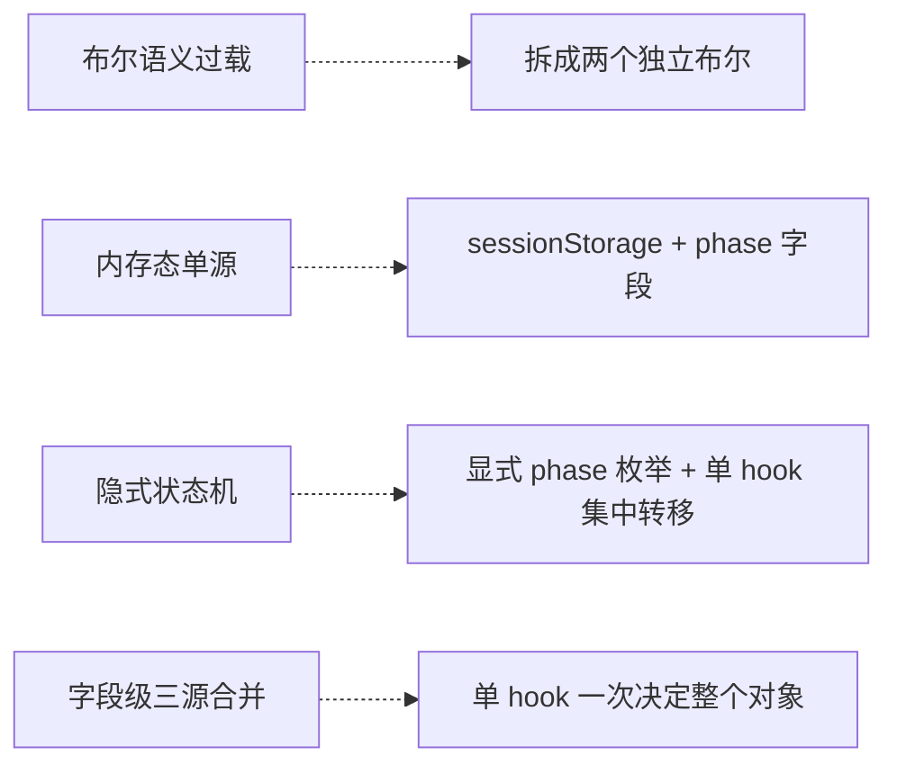

# React 页面状态管理反模式与重构

> 复杂页面的状态管理常在不知不觉中累积多种反模式——单布尔承担多语义、内存态无法穿透整页跳转、状态机隐式散布、字段级三源合并。本页总结这些典型反模式，以及它们对应的合理重构模式。

## 是什么

"React 页面状态反模式"指的是一类**页面逐渐演化过程中自然形成**的结构性坏味道：

- 每一次需求迭代都只加一点代码（一个布尔、一个 useEffect、一个 ?? 兜底）
- 单看每次变更都合理
- 累积后页面变成：300+ 行组件、多个 useEffect 彼此耦合、隐式状态机、上下文来源四处拼凑

这些反模式不会让功能立即出错，但会让：
1. **修 bug 变危险**——任何改动都可能踩到其他路径
2. **加功能变慢**——需要读完整个文件才敢动手
3. **边界场景白屏**——整页跳转、刷新、OAuth 重定向之类的链路容易遗漏

本页把四个最常见的反模式与其重构对策成对记录。

## 为什么重要

- **让 code review 有抓手**：给反模式起名字之后，审查时一眼能看出来（"这是典型的布尔语义过载"）
- **指导重构优先级**：知道哪些反模式是"白屏温床"、哪些是"纯技术债"
- **在 AI 辅助编码里特别重要**：LLM 生成代码默认追加不重构，反模式会被放大

## 四大反模式与重构模式



---

### 反模式 1：布尔语义过载（Boolean Semantic Overload）

一个布尔变量被用来表达**两种以上不同语义**，初期只是"恰好两边都为 true 时行为一致"，迭代中两种语义逐渐分化，修任何一侧都会误触发另一侧。

**症状代码**：

```ts
const fromPay = fromPayQuery || pendingCtxMatches;
// 语义 A: URL 带 fromPay=1，用户刚从第三方支付回跳 → 自动轮询
// 语义 B: sessionStorage 中有可兜底的上下文 → 允许字段兜底展示

if (fromPay) {
  return <Loading title="正在确认支付结果" />;  // 基于语义 A
}
const subtitle = state?.subtitle ?? (fromPay ? pendingCtx?.subtitle : null);
                                 // 基于语义 B
```

**踩坑场景**：想加一行"进入页面时写 sessionStorage 兜底"，结果：
- session 有数据 → `pendingCtxMatches = true` → `fromPay = true`
- 页面误判"用户从支付回跳" → 跳进"正在确认支付结果"loading → 自动轮询一笔**从未发起的支付**

**重构：两个独立布尔**

```ts
const isReturningFromPayment =
    urlHasFromPay ||
    (pendingCtx?.phase === 'paying' && matchesCurrentContext);
// 语义 A：只管"是否应该自动轮询/显示 confirming UI"

const hasRestorableContext =
    pendingCtx != null && matchesCurrentContext;
// 语义 B：只管"能否用 session 兜底展示字段"
```

两者不再共享同一个变量，职责独立可测。

**判断标准**：
- 一个布尔变量的定义式里出现 `||` 或 `&&` 合并多个**异源**条件 → 警惕
- 使用处分别描述 "X 是 Y 时应该 A" 与 "X 是 Y 时应该 B"，而 A 与 B 并无因果关系 → 重构

---

### 反模式 2：内存态单源（Memory-Only Source of Truth）

关键业务状态只存在于 React 内存（`location.state`、`useState`、`useRef`），没考虑到下列会导致内存清零的链路：

- OAuth 整页重定向（`window.location.replace`）
- 第三方支付跳转（`window.location.href = payUrl`）
- 支付宝 H5 的 `document.write(redirect_html)`（会清空当前 document）
- 用户刷新、返回、分享出去的链接
- 移动端 webview 被系统回收

**症状**：

```
站内 navigate('/pay', { state: ctx })
   → useWechatAuth 发现 401
   → window.location.replace(oauth_url)
   → 微信授权 → 302 回 /pay
   → React 冷启动
   → location.state = null
   → hasContext = false
   → return null (白屏)
```

**重构：sessionStorage + phase 字段作为权威来源**

单纯加 sessionStorage 不够——需要区分"session 里的数据处于哪个语义阶段"：

```ts
interface PersistedContext {
  ctx: BusinessContext;
  phase: 'entry' | 'paying';   // 关键字段
  timestamp: number;
}
```

- `phase: 'entry'` — 进入页面时写，用于**穿越整页跳转**恢复上下文
- `phase: 'paying'` — 真正发起支付前写，意味着"预期会回跳轮询"

phase 字段让两类写入语义互不混淆，避开"一写 session 就被误判为支付回跳"的陷阱（见反模式 1）。

**写入规则（防止覆盖）**：

```ts
function writeEntryIfAbsent(ctx) {
  const existing = readPersisted();
  if (existing?.phase === 'paying' && existing.ctx.id === ctx.id) {
    return;  // 不覆盖已发起的支付
  }
  writePersisted(ctx, 'entry');
}
```

**适用范围**：任何会触发整页跳转的业务链路——OAuth、第三方支付、第三方分享回跳、App Webview 被系统回收后恢复。

---

### 反模式 3：隐式状态机（Implicit State Machine）

状态用多个 `useState` + 多个 `useEffect` 隐式编排，转移规则散布在各处，无法从单点读懂全貌。

**症状**：

```ts
const [payStatus, setPayStatus] = useState<'idle'|'loading'|'polling'|
    'success'|'timeout'|'error'>('idle');

// Effect 1: success 时导航
useEffect(() => {
  if (payStatus === 'success') navigate(returnPath, { state });
}, [payStatus]);

// Effect 2: fromPay 自动轮询
useEffect(() => {
  if (fromPay && user && !checking) pollResult();
}, [fromPay, user, checking]);

// 在 startPay / pollResult 内部散布 setPayStatus('loading')
// 在 pollResult 内部散布 setPayStatus('timeout' | 'success' | 'error')
```

读代码时必须同时在脑海里运行所有 effect + 所有回调才能搞清"此时 phase 为什么是 X"。

**重构：显式 phase + 单 hook 集中转移**

```ts
type Phase = 'entry' | 'paying' | 'confirming' | 'success'
           | 'timeout' | 'error' | 'session-expired';

function usePaymentFlow(ctx): { phase: Phase; startPay: () => void } {
  const [phase, setPhase] = useState<Phase>(initialPhaseFor(ctx));

  // 所有转移都写在这里
  function startPay() {
    setPhase('paying');
    boltStartPay({ onBeforeRedirect: () => persist(ctx, 'paying') });
  }

  useEffect(() => {
    if (phase !== 'confirming') return;
    const stop = poll({
      onSuccess: () => { clearPersisted(); setPhase('success'); },
      onTimeout: () => setPhase('timeout'),
      onFail:    () => setPhase('error'),
    });
    return stop;
  }, [phase]);

  useEffect(() => {
    if (phase === 'success') navigate(ctx.returnPath, { state: successState(ctx) });
  }, [phase]);

  return { phase, startPay };
}
```

页面层退化为 switch：

```tsx
switch (flow.phase) {
  case 'confirming':      return <Confirming/>;
  case 'session-expired': return <SessionExpired/>;
  default:                return <Layout ctx={ctx} flow={flow}/>;
}
```

**收益**：
- 转移规则集中一处
- 状态空间显式（7 个 phase 一目了然）
- 页面层不再散布 setState
- 单测从"测一堆 effect 交互"变成"测 phase 转移"

**什么时候升级到 useReducer / XState**：
- 转移条件依赖多个输入的组合且要同步执行多个副作用 → useReducer
- 状态机有层级、并行、guard 表达需求 → XState
- 本例 6-7 个 phase + 简单 action，普通 useState 够用，保留简洁

---

### 反模式 4：字段级三源合并（Per-field Three-way Coalesce）

同一个对象的字段分别从 query / state / session 三个源读取，用嵌套 `?:` 或 `??` 逐字段选择。

**症状**：

```ts
const orderId = hasQuery ? queryOrderId : hasState ? state?.orderId : pending?.orderId;
const bizId   = hasQuery ? queryBizId   : hasState ? state?.bizId   : pending?.bizId;
const payId   = hasQuery ? queryPayId   : hasState ? state?.payId   : pending?.payId;
// ... 再 7 个字段
```

**问题**：
- 每字段独立选源，但业务上字段属于**同一对象**，应来自同一源
- 新增字段要改 N 处
- 改变优先级要改 N 处
- 难以单元测试

**重构：单 hook 一次决定整个对象**

```ts
function usePaymentContext(): PaymentContext | null {
  const { state, search } = useLocation();
  const query = parseQuery(search);
  const persisted = useLazyRef(() => readPersisted());

  const source =
    query.hasFromPay ? 'query' :
    state?.orderId   ? 'state' :
    persisted?.orderId ? 'session' : null;

  if (!source) return null;
  return buildFromSource(source, { query, state, persisted });
}
```

**唯一需要跨源叠加的场景**：query 源缺展示字段时用 session 兜底，封装在 `buildFromSource` 内部，不泄漏到调用方。

---

## 反模式之间的关联

```
  反模式 1（布尔语义过载）
       │ 常因之一：用同一 fromPay 处理"回跳"和"兜底"
       ▼
  反模式 2（内存态单源）
       │ 修复时引入 session 兜底，容易踩反模式 1
       ▼
  反模式 3（隐式状态机）
       │ 散布的 useEffect 让 1 和 2 的修复更难
       ▼
  反模式 4（字段级三源合并）
       │ 多源数据的"如何合并"被 inline 处理，反过来让 1/2/3 更难拆
```

四者常**结伴出现**。重构时按这个顺序拆：先修反模式 1（最小改动治白屏），再上反模式 2 + 3（引入 phase + hook 状态机），最后做反模式 4（抽取 context hook）。

## 项目实践

### horizon-web-commerce（2026-04-27）

`apps/landing/src/pages/common/pay/` 支付页在微信 OAuth 重定向回跳时白屏，审查发现四种反模式**同时存在**：

| 反模式 | 证据 |
|--------|------|
| 1. 布尔语义过载 | `fromPay = fromPayQuery \|\| pendingMatches` 同时表达"从支付回跳"与"session 可兜底" |
| 2. 内存态单源 | `location.state` 是唯一权威来源，OAuth 整页跳走即丢失 |
| 3. 隐式状态机 | `payStatus` 六态 + 3 个 useEffect + 散布的 setState |
| 4. 字段级三源合并 | 9 行三元嵌套，每字段独立从 query/state/session 选源 |

**落地为两个 OpenSpec change**：
- `openspec/changes/fix-payment-oauth-redirect-whitescreen/` — 只修反模式 1 + 反模式 2（引入 phase 字段 + 拆双布尔），最小改动止血
- `openspec/changes/refactor-payment-page-state-machine/` — 完整重构反模式 3 + 4（显式 phase 状态机 + `usePaymentContext` / `usePaymentFlow` / `useCancelOrder` / `PaymentLayout` 拆分）

拆两个 change 的动机：bug fix 和结构重构**不能混在一个 PR 里** review。

## 上位框架：React 状态五分类

本页四个反模式都可以映射到 [[react-state-categories|React 状态五分类]]：

| 反模式 | 涉及的状态类别 |
|-------|---------------|
| 1. 布尔语义过载 | URL State（fromPayQuery）+ Application State（pendingCtx） |
| 2. 内存态单源 | Application State（location.state）过于脆弱，应上升到 sessionStorage 层 |
| 3. 隐式状态机 | Component State 的多个 useState + useEffect 隐式编排 |
| 4. 字段级三源合并 | URL / Application / Application 三源被**字段级**合并，应该**整对象**一次决策 |

本页讨论的场景本质上是"**多类 state 被混成一锅**"。分清楚来源之后，反模式 4 的解法（单 hook 按源优先级一次性决定整对象）就是自然的。

## 相关概念

- [[react-state-categories|React 状态五分类]] — 本页反模式的上位分类框架
- [[react-classic-antipatterns|React 经典反模式（组件层）]] — 互补的微观视角：单组件内部的反模式词典（derived state / mutate / index key / render 里新建引用等）
- [[feature-based-architecture|Feature-Based 架构]] — feature 内部如何组织状态的上位框架
- [[unified-payment-route|统一支付路由设计]] — 本次反模式识别的具体业务场景
- [[clean-code|整洁代码]] — SOLID / DRY / YAGNI 通用原则
- [[refactoring|重构]] — 不改外在行为改善内部结构
- [[server-state-management|服务端状态管理]] — 当状态源自网络请求时的另一类模式（TanStack Query / SWR）
- [[oauth-state-parameter|OAuth state 参数]] — 触发反模式 2 的典型链路之一
