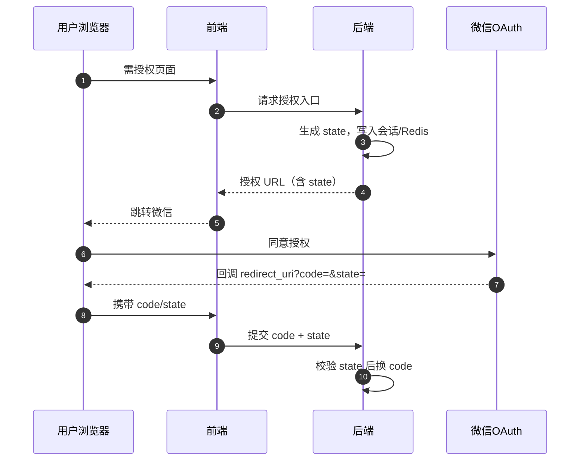

# OAuth state 参数（微信网页授权）

> `state` 是 OAuth 授权请求中的可选参数；微信会在回调时原样带回，用于 **防 CSRF** 与 **透传短期业务上下文**。

## 是什么

在 [微信网页授权](https://open.weixin.qq.com/connect/oauth2/authorize) 等 OAuth2 流程中，授权 URL 通常包含 `state`。用户同意授权后，微信重定向到 `redirect_uri`，并在查询串中附带 `code` 与 **`state`（若发起时传入）**。

与 `code` 不同：`state` **不由微信生成业务含义**，由你的系统定义；微信只负责 **往返透传**。

## 为什么重要

1. **CSRF（跨站请求伪造）防护**：攻击者可能诱导受害者完成一次「对自己账号」的授权，若没有与当前会话绑定的随机 `state`，回调阶段难以证明「这次 `code` 对应的是我刚才发起的那次授权」。
2. **回跳上下文**：例如用户从商品页发起登录，回调后需要回到原路径；可将目标路径与随机串一起绑定在服务端，或仅用随机串索引已存上下文。

## 基本用法（推荐）

1. 用户点击「微信登录」或进入需授权页时，**服务端**生成不可预测随机串（nonce）作为 `state`，与当前会话或用户意图（如 `returnTo`）**短期**存入 Redis/Session，设置 TTL（如 5～10 分钟）。
2. 跳转微信授权 URL 时带上该 `state`。
3. 回调到达时 **先校验** `state`：存在、一致、未过期、一次性消费；**再**用 `code` 换 token。
4. 不要在 `state` 里放敏感明文；业务参数更适合存服务端，仅用 `state` 作键或配合签名。

## 项目实践

### megrez-shop

- `src/components/common/WechatH5.tsx`（约 15～21 行）— 微信内 H5 在未取到登录态时会跳转到网页授权链接；当前 URL **未包含 `state` 参数**，回站上下文通过 `redirect_uri` 上查询参数 `fenbiUrl`（编码后的 `window.location.href`）传递。
- **说明**：若需严格防 CSRF 或与会话绑定，建议在由你方控制的后台授权入口中生成并校验 `state`；仅靠 URL 参数回跳时需自行评估开放重定向与伪造回调风险（可对照站内 `open-redirect` 防护思路）。

## 相关概念

- [[open-redirect|Open Redirect]] — 若用 URL 参数表示回跳目标，需白名单校验
- OAuth2 `authorization code` — `code` 与 `state` 在回调中常同时出现，`code` 换令牌、`state` 校验请求合法性
